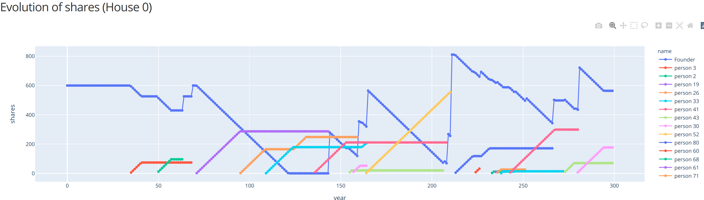
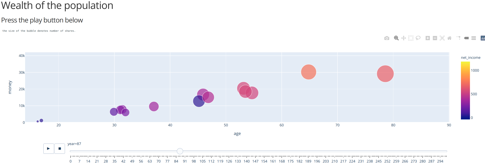

# Housing by shares

We need a house to live in. To do so, the most common options are:

1. To rent a house
2. To buy a house

This simulation explores "Housing by shares," a hybrid mechanism that lives somewhere in between option 1 and 2

## The problem

Everyone wants to own a house, but not everyone can buy a home.

The ability to own a house is determined by an individual's access (or lack of access) to financing, and lower-income individuals have less access. 
Banks are more likely to offer to finance to those who already own capital or, thanks to higher incomes, have greater repayment capacities.

People with lower-income must take on significant and unsustainable debt burdens, which reduced wealth among the bottom income groups, increased poverty, and further exasperated inequalities.

Also, Inheritance plays a significant effect on social stratification, affecting the distribution of wealth. Heritage is transmitted across generations, determining people's chances in society.  Those who receive an inheritance are more likely to own a home than those who do not.

How can we smooth these existing disparities, which also have intergenerational consequences?

## The mechanism

A person pays a fee to live in a house just like in renting, but with the possibility of owning a fraction of the house, materialized in shares. The paid price goes proportionally to all the share-holders that previously lived in the house.

The idea is that a person collects several shares during her lifetime, that will represent an income in the future, especially when the person is retired.

## Setup

A community needs a founder, for example, the government or a big cooperative

Houses enter the community, bought in traditional markets by the founder.  Each time a house enters, it's initial value is divided into a fixed amount of shares that are transferred to the founder, meaning that in the beginning, he is the only shareholder.

If a person wants to live for one month in one of those houses, she has to pay a fee corresponding to the price of a share. The paid amount goes proportionally to all share-holders, and one share is created to the person, and one share of the founder is destroyed.

When a person dies, the shares go back to the founder (government), that can build more houses. To ensure the share-influx, shares are not bought or sold in the open market.

## Simulation

I don't have a finished idea of how this would work, so I programmed a simple simulation that spans for 300 years, in a micro community of people.
People can have childs and die, and wants to give the *Housing by shares* a try.

Since this is only a preliminary exploration, I try to keep it simple, for example,there are no taxes.

Initial values:

- The number of initial shares created corresponds to the number of months an average person can live. 
- The price of each share is simply the house's initial price divided by the number of initial shares.

I'm exploring two options, with inheritance and without, to see how it goes. If inheritance is enabled, a random sibling inherits the shares, otherwise the founder.

Some screenshots:






to run the simulation:

```
python application.py
```

Jun, 2020, Cristian Vasquez


## Other remedies  (from Wikipedia)

Proposals to remedy the adverse effects of housing inequality include:

Subsidized housing, also known as affordable housing. Subsidized housing includes:
* Co-operative housing
* Non-profit housing
* Direct housing
* Public housing
* Rent supplements
* Scattered-site housing - A housing system where rent is based on household income
* Fair-lending enforcement - Lenders are expected to not discriminate against borrowers because of family status, race, originality, gender, and color


